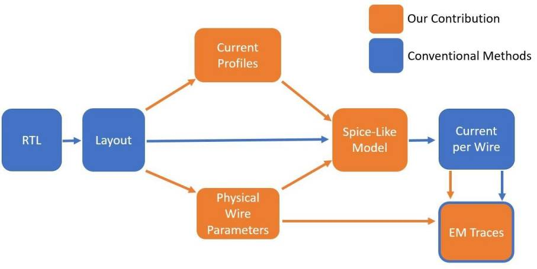

- EMSim is designed to predict the EM emanations from ICs at the layout level.
- Version 1.0
- Contacts: 
    - Haocheng Ma : hc_ma@tju.edu.cn
    - Yier Jin : jinyier@gmail.com

# Table of contents
- [Prerequisites](#prerequisites)
- [Running EMSim](#running-emsim)
    - [Data Preparation](#data-preparation)
    - [Current Analysis](#current-analysis)
    - [Electromagnetic Computation](#electromagnetic-computation)
- [Contributors](#contributors)
- [Copyright](#copyright)

# Prerequisites
At a minimum:

- Python 3.8+ with PIP
- VCS, Calibre xRC, PrimeTime PX, HSpice
- Linux or Windows

# Running EMSim
EMSim consists of three main steps: data preparation, current analysis and EM computation.

<table>
  <tr>
    <td  align="center"></td>
  </tr>
</table>

## Data Preparation

A RTL-to-GDS flow is a prerequisite to creating a layout database, which provides input data for EMSIM.

```
design.gds                # GDSII data of physical layout
design.v                  # layout-level netlists in Verilog
design.def                # physcial design data in DEF
design.sdc                # timing constraints
design.sdf                # timing data to specify interconnect delay and cell dealys
design.spef               # parasitic data in SPEF
```

## Current Analysis

Current analysis aims to simulate transient currents flowing in power grids of ICs.

### Detailed Parasitics

```
generate_lvs_rule.py
optional arguments:
  [ --help ]                       see help
  [ --def_path ]                   path to the def file, should end in .def
  [ --hcell_path ]                 path to the output hcell file
  [ --xcell_path ]                 path to the output xcell file
  [ --lvs_rule_path ]              path to the output lvs_rule file
```
We use `Calibre xRC` to perform gate-level extraction on the physical layout. Through this we extract parasitics down to individual logic cells, while still preserving the cell’s internal structure and hierarchy. The `generate_lvs_rule.py` script creates folloing input files required for gate-level extraction.
- Hcell file that includes all cells also listed in the xcell file.
- Xcell file listing cells which will not undergo parasitic extraction.
- Additional rules that required for the valid PEX rule file.
- Note: 
    - You should disable device types in the PEX rule file, if they have been used in this design.
    - Output actual locations, widths, lengths, layers and thicknesses of resistance.
    - Create a DSPF netlist you specified in the PEX Netlist statement.

### Cell Current

```
process_vcd_file.py
optional arguments:
  [ --help ]                       see help
  [ --vcd_init_path ]              Path to the init vcd file, should end in .vcd
  [ --vcd_final_path ]             Path to the output vcd file
  [ --header_path ]                Path to the header vcd file
  [ --start_time_point ]           Start time point for power analysis, timescale 1ns/1ps
  [ --num_plaintexts ]             amount of the required plaintexts
  [ --desired_time_interval ]      desired time slice for power analysis, timescale 1ns/1ps
  [ --off_time_interval ]          Time interval between two-times power analysis, timescale 1ns/1ps
```
We obtain the switching activities of logic cells during functional simulation. For specific stimuli, `Synopsys VCS` records a vcd file in given time intervals. The `process_vcd_file.py` script cuts off the vcd file into vcd files corresponding to each stimulus. These vcd files will be used for power analysis. Also, the `generate_ptpx_tcl.py` script generates tcl files based on a template `ptpx.tcl`. These tcl files will control the workflow of power analysis.
- Note:
    - You should alter file paths in `ptpx.tcl` beforehand.
    - You should define `-waveform_interval` in `ptpx.tcl` beforehand.

```
generate_ptpx_tcl.py
optional arguments:
  [ --help ]                       see help
  [ --ptpx_tcl_path ]              path to the template ptpx file, should end in .tcl
  [ --output_tcl_path ]            path to the output ptpx file, should end in ptpx
  [ --start_time_point ]           start time point for power analysis, timescale 1ns/1ns
  [ --num_plaintexts ]             amount of the required plaintexts
  [ --desired_time_interval ]      desired time slice for power analysis, timescale 1ns/1ns
  [ --ptpx_run_path ]              path to the run folder of ptpx
```
`PrimeTime PX` performs time-based power analysis to find the transient power of logic cells. The `logic_cell_modeling.py` script processes power reports from power analysis, then model current profiles for each logic cell.

```
logic_cell_modeling.py
optional arguments:
  [ --help ]                       see help
  [ --top_cell ]                   top cell in the design
  [ --parasitic_netlist_path ]     path to the parasitic info file, should end in .dspf
  [ --def_path ]                   path to the def file, should end in .def
  [ --power_report_path ]          path to the power report file, should end in .out
  [ --num_plaintexts ]             amount of the required plaintexts
  [ --start_time_point ]           start time point in the initial power report
  [ --desired_time_interval ]      desired time interval to use, timescale 1ns/1ns
  [ --desired_time_scale ]         desired time scale used in power analysis
  [ --power_report_init_path ]     path to the init power report file, should end in vcd_
  [ --power_supply_voltage ]       supply voltage for logic cells
```

### Spice Model

```
logic_cell_to_current_source.py
optional arguments:
  [ --help ]                       see help
  [ --lc_currents_path ]           path to the simulated logic cell currents
  [ --power_port ]                 VDD and VSS port in physical layout
  [ --mark_net ]                   start and break net in the .dspf file, should end in a blank
  [ --netlist_path ]               path to the parasitic netlist, should end in .dspf
  [ --desired_time_scale ]         desired time scale used in power analysis
```
The `logic_cell_to_current_source.py` script extracts the parasitic model of complete power grids from the DSPF netlist. It then processes current profiles of logic cells into Piece-Wise Linear (PWL) current sources.
```
Prep_For_Sim.py
optional arguments:
  [ --help ]                       see help
  [ --parasitic_netlist ]          path to the parasitic netlist, should end in .dspf
  [ --metal_layers ]               target metal layers
  [ --power_port ]                 VDD and VSS port in physical layout
  [ --template_file ]              path to the default sp template file
  [ --output_file ]                path to write the final sp to
```
On the basis of a template `template.txt`, the `Prep_For_Sim.py` srcipt combines a parasitic model, current profiles, voltage and current source models to describe the physics and topology of a target circuit. It produces the final Spice model `final.sp` and files describing physical information of power grids in upper metal layers. The Spice-style simulator `HSpice` solves the transient current in each metal wire with different initial conditions, e.g., plaintext and key for cryptographic circuits.
- Note:
    - You should alter simulation settings in `template.txt` beforehand.

## Electromagnetic Computation

Electromagnetic computation aims to approximate the EM emanations from currents across upper metal layers.

```
tr_to_h5.py
optional arguments:
  [ --help ]                       see help
  [ --num_plaintexts ]             number of required plaintexts
  [ --spice_result_path ]          path to result files from Spice simulation
  [ --metal_layers ]               target metal layers
  [ --output_file ]                path to final currents across metal wires
```
The `tr_to_h5.py` script converts spice results `final.tr` into h5 format `last_binary_run.h5`. Then the `Compute_EM_formulation.py` script computes magnetic field at a certain time, at a certain point. 

```
Compute_EM_formulation.py
optional arguments:
  [ --help ]                       see help
  [ --metal_layers ]               target metal layers
  [ --transient_file ]             Path to the transient analysis file, should be in csv form
  [ --use_gpu ]                    allow for gpu acceleration
  [ --num_input_stimuli ]          Number of required plaintexts for em computation
  [ --clock_period_ns ]            Amount of sample points per input stimuli
  [ --start_time_ns ]              Start time point in simulation per input stimuli
  [ --end_time_ns ]                End time point in simulation per input stimuli
  [ --target_area_x ]              Target simulated area in x axial direction
  [ --target_area_y ]              Target simulated area in y axial direction
  [ --num_probe_x_tiles ]          Number of point grid in x axial direction
  [ --num_probe_y_tiles ]          Number of point grid in y axial direction
  [ --num_probe_z_tiles ]          Number of point grid in z axial direction
  [ --layout_max_z ]               Target simulated distance in z axial direction, option value = true value x 2
  [ --num_horizontal_tiles_per_wire ]  Number of horizontal tiles per metal wire
  [ --num_vertical_tiles_per_wire ]    Number of vertical tiles per metal wire
  [ --ns_per_sample ]              Simulated value of time scale per sample point
  [ --output ]                     Path to write the output
  [ --layout_min_x ]               Reference coordinate in x axial direction
  [ --layout_min_y ]               Reference coordinate in y axial direction
```

# Contributors

| Name         | Affiliation           | email                                                     |
| ------------ | --------------------- | --------------------------------------------------------- |
| Haocheng Ma  | Tianjin University    | [hc_ma@tju.edu.cn](mailto:hc_ma@tju.edu.cn)               |
| Yier Jin     | University of Florida | [jinyier@gmail.com](mailto:jinyier@gmail.com)             |
| Max Panoff   | University of Florida | [m.panoff@ufl.edu](mailto:m.panoff@ufl.edu)               |
| Jiaji He     | Tianjin University    | [dochejj@tju.edu.cn](mailto:dochejj@tju.edu.cn)           |
| Ya Gao       | Tianjin University    | [gaoyaya@tju.edu.cn](mailto:gaoyaya@tju.edu.cn)           |

# Copyright

It is mainly intended for non-commercial use, such as academic research.

# Citation

If you utilize EMSim in your research, we kindly request citation of the respective publication: https://ieeexplore.ieee.org/abstract/document/10024840

```
@ARTICLE{10024840,
  author={Ma, Haocheng and Panoff, Max and He, Jiaji and Zhao, Yiqiang and Jin, Yier},
  journal={IEEE Transactions on Information Forensics and Security}, 
  title={EMSim: A Fast Layout Level Electromagnetic Emanation Simulation Framework for High Accuracy Pre-Silicon Verification}, 
  year={2023},
  volume={18},
  number={},
  pages={1365-1379},
  keywords={Integrated circuit modeling;Integrated circuits;Mathematical models;Computational modeling;Analytical models;Security;Layout;CAD for security;EM~emanation simulation;side channel analysis},
  doi={10.1109/TIFS.2023.3239184}}
```


