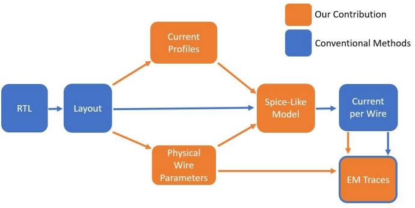

- EMSim is designed to predict the EM emanations from ICs at the layout level.
- Version 1.0
- Contacts: 
    - Haocheng Ma : hc_ma@tju.edu.cn
    - Yier Jin : jinyier@gmail.com

# Table of contents
- [Prerequisites](#prerequisites)
- [Running EMSim](#running-EMSim)
    - [Data Preparation](#data-preparation)
    - [Current Analysis](#current-analysis)
    - [Electromagnetic Computation](#electromagnetic-computation)
- [Contributing](#contributing)
- [License](#license)

# Prerequisites
At a minimum:

- Python 3.8+ with PIP
- VCS, Calibre xRC, Primetime PX, HSpice
- Linux or Windows

# Running EMSim
EMSim consists of three main steps: data preparation, current analysis and EM computation.

<table>
  <tr>
    <td  align="center"></td>
  </tr>
</table>

## Data Preparation

A RTL-to-GDS flow is a prerequisite to creating a layout database, which provides input data for EMSIM.

```
design.gds                # GDSII data of physical layout
design.v                  # layout-level netlists in Verilog
design.def                # physcial design data in DEF
design.sdc                # timing constraints
design.sdf                # timing data to specify interconnect delay and cell dealys
design.spef               # parasitic data in SPEF
```

## Current Analysis

Current analysis aims to simulate transient currents flowing in power grids of ICs.

### Extract Detailed Parasitics

```
generate_lvs_rule.py
optional arguments:
  [ --help ]                       see help
  [ --def_path ]                   path to the def file, should end in .def
  [ --hcell_path ]                 path to the output hcell file
  [ --xcell_path ]                 path to the output xcell file
  [ --lvs_rule_path ]              path to the output lvs_rule file
```

### Analyze Logic Power

```
generate_ptpx_tcl.py
optional arguments:
  [ --help ]                       see help
  [ --ptpx_tcl_path ]              path to the template ptpx file, should end in .tcl
  [ --output_tcl_path ]            path to the output ptpx file, should end in ptpx
  [ --start_time_point ]           start time point for power analysis, timescale 1ns/1ns
  [ --num_plaintexts ]             amount of the required plaintexts
  [ --desired_time_interval ]      desired time slice for power analysis, timescale 1ns/1ns
  [ --ptpx_run_path ]              path to the run folder of ptpx
```

```
process_vcd_file.py
optional arguments:
  [ --help ]                       see help
  [ --vcd_init_path ]              Path to the init vcd file, should end in .vcd
  [ --vcd_final_path ]             Path to the output vcd file
  [ --header_path ]                Path to the header vcd file
  [ --start_time_point ]           Start time point for power analysis, timescale 1ns/1ps
  [ --num_plaintexts ]             amount of the required plaintexts
  [ --desired_time_interval ]      desired time slice for power analysis, timescale 1ns/1ns
  [ --off_time_interval ]          Time interval between two-times power analysis, timescale 1ns/1ps
```

### Hybridize Spice Model

## Electromagnetic Computation


# Contributing


# License
